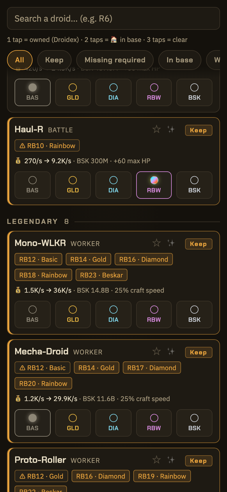
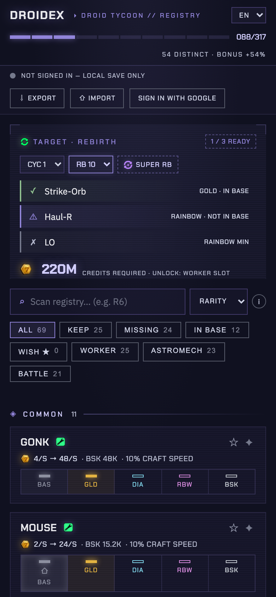

# Droidex — Droidsmith's Registry

Community collection tracker for **Star Wars: Droid Tycoon**, the Fortnite mode created by FOAD/Blzn Studios (released May 1st, 2026).

The game features a Droidex of 200+ collectible droids across 5 variants (Basic, Gold, Diamond, Rainbow, Beskar) and 23 Rebirth levels, each requiring 3 specific droids **physically present in your base**, plus credits. Standing at the Sandcrawler shop, the game gives you no way to know what you already own — this tracker fills that gap.

> 📱 Designed to be used on your phone, next to the console. Installable as an app (PWA). English by default, French available from the in-app language selector.

<!-- TODO: add screenshots


-->

## Features

- **Per-variant tracking** with 3 tap-cyclable states: never owned → owned (Droidex entry) → 🏠 in base (physical presence) → clear.
- **Higher-variant rule**: a Diamond droid always satisfies a "Gold" requirement.
- **"Next targeted rebirth" panel** (1–23): the 3 required droids with their status (✗ not owned, ⚠ owned but not in base, ✓ ready) and the credits needed.
- **Requirement badges** on each droid (e.g. "RB9 · Gold"): struck through only once the rebirth is behind you — never a future requirement, even when satisfied.
- **"Keep" tag** as long as a future rebirth depends on the droid; orange outline when action is needed.
- **Filters**: All / Keep / Missing required / In base / Worker / Astromech / Battle, plus search.
- **Iconic droids** (BB-8, Mister Bones, IG-11 Marshal, DJ R-3X, R2-D2): simple owned + in-base toggles, no variants.
- **Cross-device sync (optional)**: sign in with a Google account and your registry follows you. Without an account, everything stays in your browser (`localStorage`) — no tracking, no mandatory signup.
- **JSON export/import** as a fallback, or to stay 100 % offline.
- **Two languages**: English (default) and French, switchable from the header dropdown.

## Usage

### Online

Just open the site and tick your droids. On mobile, use "Add to Home Screen" to install it as an app (works offline afterwards).

### Syncing between devices

Two options:

- **Google account** (recommended): "Sign in with Google" button at the bottom of the page. Your registry is saved server-side and automatically restored on any device signed in with the same account. Last write wins; "Delete my account" wipes everything server-side.
- **Manual**: **Export backup** → downloads `droidex-backup.json` → transfer the file (AirDrop, email…) → **Import** on the other device.

## Self-hosting (Docker)

Two containers:

- **droidex**: the static site (nginx).
- **pocketbase**: the sync API ([PocketBase](https://pocketbase.io) 0.39, single binary + SQLite). Optional — without it, the site works in pure local mode.

### Local test

```bash
docker compose -f docker-compose.local.yml up -d
# Site: http://localhost:8080 — API: http://localhost:8090
```

### VPS behind Traefik (v2 or v3)

Prerequisites: an existing Traefik with a `websecure` entrypoint, an ACME certificate resolver and an external Docker network. Two DNS records pointing to the VPS: `droidex.yourdomain.com` and `api.droidex.yourdomain.com`.

```bash
git clone https://github.com/n4ckz/droidex.git && cd droidex
cp .env.example .env
# then edit .env:
#   DROIDEX_DOMAIN=droidex.yourdomain.com
#   TRAEFIK_NETWORK=proxy            # your Traefik docker network name
#   TRAEFIK_CERTRESOLVER=letsencrypt # your ACME resolver name
docker compose up -d

# create the PocketBase admin account (once)
docker compose exec pocketbase /pb/pocketbase superuser upsert YOUR@EMAIL.com YOUR_PASSWORD --dir=/pb/pb_data
```

Both containers expose an HTTP healthcheck, visible via `docker ps`. PocketBase data lives in `./pb_data` (include it in your VPS backups).

### Enabling Google sign-in (once the site is up)

1. [Google Cloud Console](https://console.cloud.google.com/) → create a project → **APIs & Services › OAuth consent screen**: type "External", fill in name and email. Only basic scopes (email, profile) are used: **no Google verification is required**; publish the app ("In production").
2. **Credentials › Create credentials › OAuth client ID** → type "Web application". Under **Authorized redirect URIs**, add:
   - `https://api.droidex.yourdomain.com/api/oauth2-redirect`
   - `http://localhost:8090/api/oauth2-redirect` (for local testing)
3. Open the PocketBase console `https://api.droidex.yourdomain.com/_/`, sign in with the admin account, then **Collections › users › ⚙ Options › OAuth2**: enable **Google** and paste the Client ID and Client Secret.

That's it: the site's "Sign in with Google" button now works. The `saves` collection (one backup per user, readable/writable only by its owner) is created automatically by migration on first startup.

### Without Traefik / without sync

Serve the `site/` folder with any static file server. To disable sync entirely (and hide the account UI), set `PB_URL` to `''` in [`site/config.js`](site/config.js). By convention, the frontend looks for the API at `api.<site domain>` (editable in that same file).

## Project structure

```
site/               The complete static site
  index.html
  styles.css        Dark Tatooine theme
  i18n.js           EN/FR translations, language selector logic
  data.js           ⚠ Game data (droids, requirements, credits) — the ONLY file
                    to edit when the game adds content
  app.js            Logic (states, rendering, persistence, export/import)
  config.js         Sync API URL ('' to disable)
  sync.js           Account sync (PocketBase, optional)
  vendor/           Self-hosted PocketBase JS SDK (0.27.0)
  manifest.json     PWA
  sw.js             Service worker (offline shell cache — bump CACHE_VERSION
                    on every site update)
  fonts/            Self-hosted fonts (no Google Fonts requests)
  icons/            PWA icons
deploy/
  nginx.conf              nginx config (caching, gzip, sw.js never cached)
  pocketbase.Dockerfile   PocketBase image (pinned version)
  pb_migrations/          Migration creating the "saves" collection
tests/                    Test suites (see below)
Dockerfile                Static site image
docker-compose.yml        Production (Traefik): site + API
docker-compose.local.yml  Local testing
```

## Tests

```bash
docker compose -f docker-compose.local.yml up -d
docker compose -f docker-compose.local.yml exec pocketbase /pb/pocketbase superuser upsert admin@test.local testpass1234 --dir=/pb/pb_data

cd tests && npm install
npm run test:app    # tracker logic (jsdom, no server): persistence, badges, migration, filters, i18n
npm run test:sync   # end-to-end against the local PocketBase: push/pull, account isolation, GDPR deletion
```

The sync test creates its own test users (`alice@test.local`, `bob@test.local`) and wipes the `saves` collection on every run — never point it at a production instance.

### Sync model

`localStorage` remains the local cache and the offline mode. When signed in, every change is pushed (1 s debounce) to the `saves` collection; on load, the account backup is pulled. If the device and the account diverge at sign-in, the user picks which one to keep. Last write wins across devices.

### Personal data (GDPR)

Accounts are optional. When one is created, PocketBase stores the Google email, the profile name and the collection registry — nothing else, no tracking. The "Delete my account" button removes the account **and** its backup (cascade deletion), with no admin intervention. If you host a public instance, remember to adapt the contact info in the footer.

## Game data and known limitations

The data (68 tracked droids including 5 Iconics, rebirth requirements 1–23, credit costs) is maintained in [`site/data.js`](site/data.js) from community sources:

- [Complete Droidex (Insider Gaming)](https://insider-gaming.com/fortnite-star-wars-droid-tycoon-droidex-all-droids/)
- [Rebirths 1–23 (community wiki)](https://star-wars-droid-tycoon.fandom.com/wiki/Rebirths)
- [The 11 Mythic droids (fdaytalk)](https://www.fdaytalk.com/fortnite-droid-tycoon-mythic-droids/)
- [General mode wiki](https://fortnite.fandom.com/wiki/Droid_Tycoon) and [dedicated wiki](https://star-wars-droid-tycoon.fandom.com/wiki/)
- [Events and Iconics](https://droidtycoonguide.com/events/)

**Known uncertainties:**

- The classes of 4 Mythics (Snow Mouse, RIC, MO-TRAK, DRFT-R) are plausible attributions, **not confirmed** by the community.
- Rebirths **21–23** (Beskar tier) are not fully verified.
- The game is updated frequently: rebirth requirements 11–18 have already been rebalanced by patches. If you spot a discrepancy, open an issue or a PR against `site/data.js`.

## License and disclaimers

Code under the [MIT license](LICENSE).

Fan project not affiliated with Epic Games, Lucasfilm or Disney. Star Wars is a trademark of Lucasfilm Ltd. Droid Tycoon is a Fortnite mode created by FOAD/Blzn Studios. No game assets are used.
